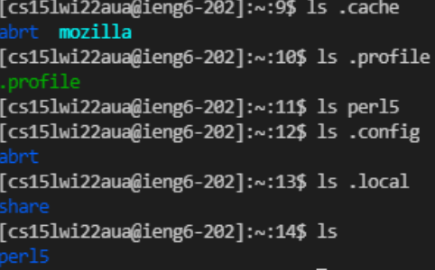

[Home](https://arl009.github.io/cse15l-lab-reports/)
## Installing VS Code

* First you want to go to the [Visual Studio downlaods](https://code.visualstudio.com/download) page
* Next download and install the version of VS Code based on the OS you have
* Once it installs you should get something that looks like this

## Remotely Connecting

* First check if OpenSSH is installed
* Open Settings, select Apps, select Apps & Features, then select Optional Features and look for it
* If not installed, click Add Feature and install OpenSSH client and OpenSSH server
* Open terminal in VS Code, enter ssh your ieng6 email and then enter your password

## Trying Some Commands
* Try running some commands like cd, ls, and cp
* It should look something like this

## Moving Files with `scp`
* I ran the line: scp WhereAmI.java cs15lwi22aua@ieng6.ucsd.edu:~/, to move WhereAmI.java to my ieng6 computer
* use the ls command to check if it is in your file directory
* then run the file using javac and java

## Setting an SSH Key
* do ssh-keygen to create an ssh key
* you should get something like the image below

* Then I ran these lines, ssh cs15lwi22aua@ieng6.ucsd.edu, mkdir .ssh, exit, scp /Users/Andric_Li/.ssh/id_rsa.pub cs15lwiaua@ieng6.ucsd.edu:~/.ssh/authorized_keys

## Optimizing Remote Running
* After setting an SSH key, you should be able to scp and ssh without typing in your password
* You can use semicolons to run multiple lines in the terminal
