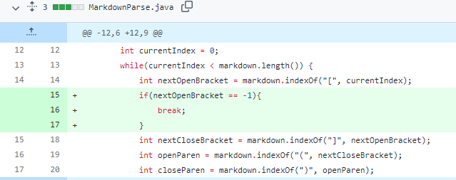
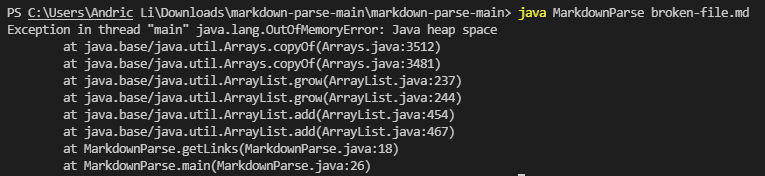
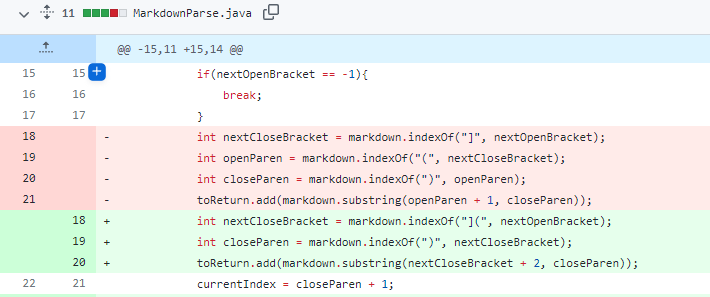
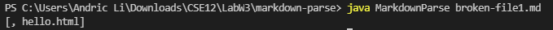
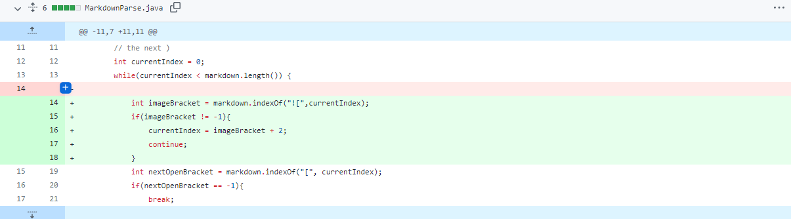
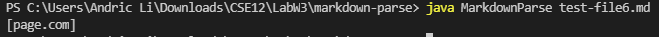

[Home](https://arl009.github.io/cse15l-lab-reports/)
# Code change 1

[broken-file.md](https://raw.githubusercontent.com/arl009/markdown-parse/main/broken-file.md)

Symptom:

Because there were a pair of brackets inside the first pair of brackets, it only looked for the first close bracket that comes after the first open bracket. This caused an infinite loop because there was no open bracket after the first close bracket.

# Code change 2

[broken-file1.md](https://raw.githubusercontent.com/arl009/markdown-parse/main/broken-file1.md)

Symptom:

The program would output anything inside paranthesis after a pair of brackets instead of links themselves. Since links have brackets and paranthesis right next to each other, the output should be `[hello.html]` and not `[, hello.html]`

# Code change 3

[test-file6.md](https://raw.githubusercontent.com/arl009/markdown-parse/main/test-file6.md)

Symptom:

The program does not differentiate between images and links since the only difference is that there is an exclamation mark in front of an image. The output still returns the image when it shouldn't, so the output should be `[]` and not `[page.com]`
