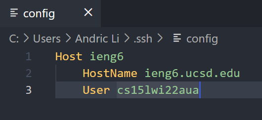
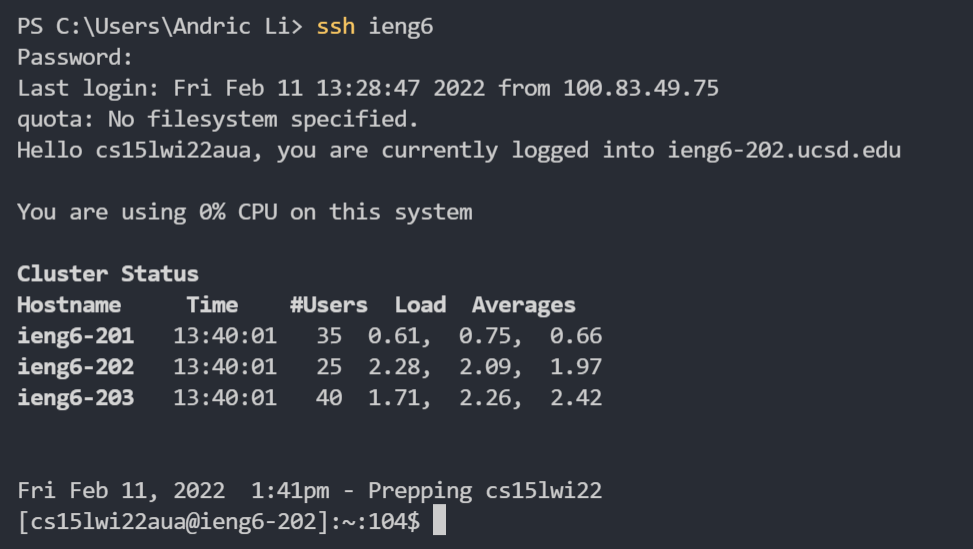
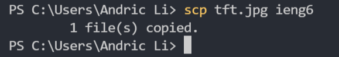

[Home](https://arl009.github.io/cse15l-lab-reports/)
# Streamlining ssh Configuration
Below is my `.ssh/config` file, which I created and edited in VSCode

I am able to log in using the alias ieng6 using the command `ssh ieng6`

I am also able to copy any file using scp to the alias I chose

