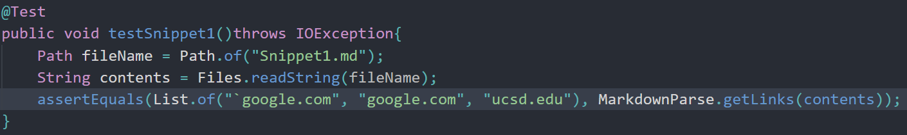
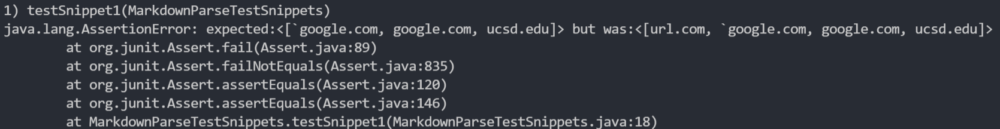
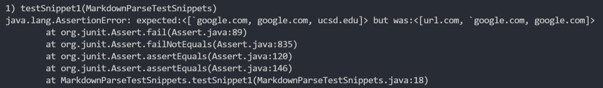
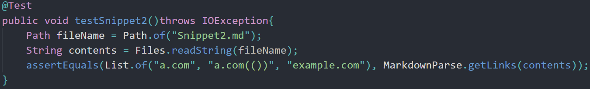
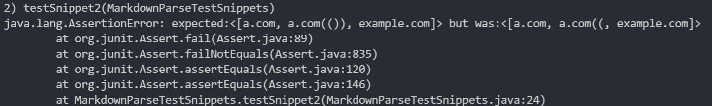
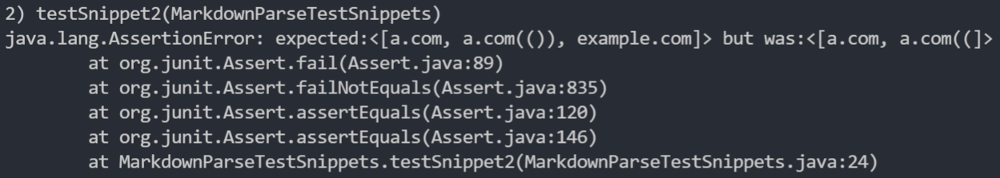
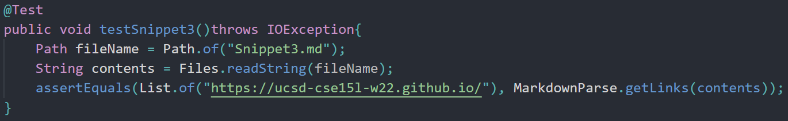
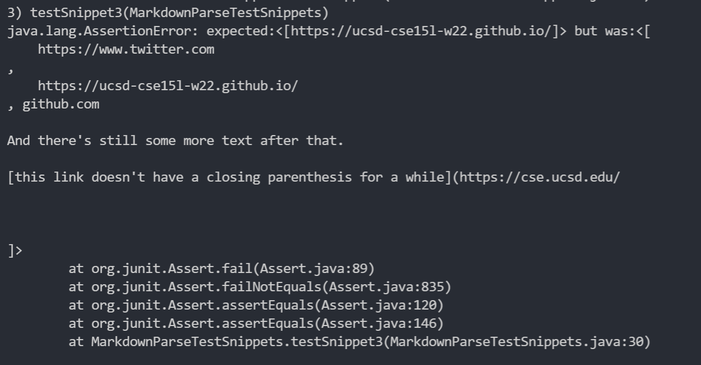
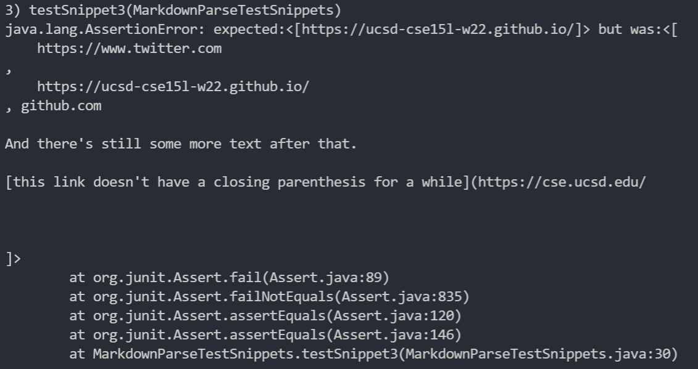

[Home](https://arl009.github.io/cse15l-lab-reports/)

My Code: [link](https://github.com/arl009/markdown-parse)
Reviewed Code:[link](https://github.com/artballesteros/markdown-parse)

# Snippet 1
The expected output is `` [`google.com]``

Test code:

My output:

Reviewed output:

I think the code change to fix all related cases that use inline code with backticks would be less than 10 lines of code because you could check the first backtick index and if the last backtick index are inside the brackets or not.

# Snippet 2
The expected output is `[a.com, a.com(()), example.com]`

Test code:

My output:

Reviewed output:

I think the code change to fix all related cases that nest parentheses, brackets, and escaped brackets would take longer than 10 lines to fix. You would probably need to implement a stack to account to keep track of nested parentheses, brackets, and escaped brackets.

# Snippet 3
I am also able to copy any file using scp to the alias I chose
The expected output is `[https://ucsd-cse15l-w22.github.io/]`

Test code:

My output:

Reviewed output:

I think it would take less than 10 lines to fix all related cases that have newlines in brackets and parentheses. All you would need to do is count if the amount of new lines for the next bracket or parentheses is greater than 1 to not add it to the list of links.
