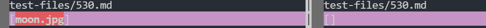

To see the differences, I entered the command `vimdiff Week9/markdown-parse/results.txt week91/markdown-parse/results.txt` to see the different outputs between both of the files. The given code is in the Week9 directory and my code is in the week91 directory

# Difference 1
The file name that produced a different output for both files was `201.md`

Output:

File `201.md`:

The expected output should be `[]` because none of the `]` brackets are right next to teh `(` parenthesis so my code is correct. The reason why the given code is wrong is because it doesn't check whether the index of the open parenthesis is exactly 1 greater than the closed parenthesis.

Right after creating the open parenthesis on line 65, you should add an if statement to check whether the index of the open parenthesis is exactly 1 greater than the closed parenthesis. If the if statement fails, do not add it the arraylist.

# Difference 2
The file name that produced a different output for both files was `530.md`

Output:

File `530.md`:

The expected output should be `[]` because there is a `!` symbol right in front of the `[` which turns it into an image instead of a link, so my code is correct. The reason why the given code is wrong is because it doesn't check whether there is an exclamation mark in front of the open bracket.

Right after creating the open bracket on line 57, you should add an if statement to check whether there is an exclamation mark exactly 1 index before the open bracket. If the if statement fails, do not add it the arraylist.
